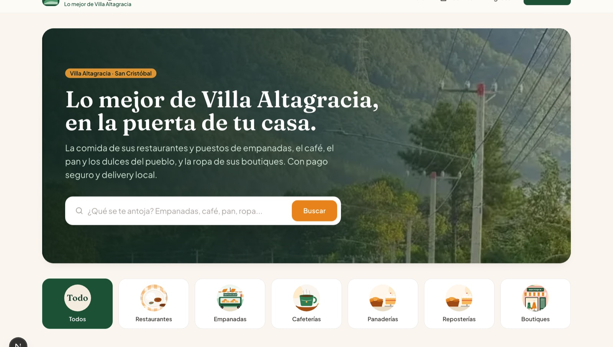
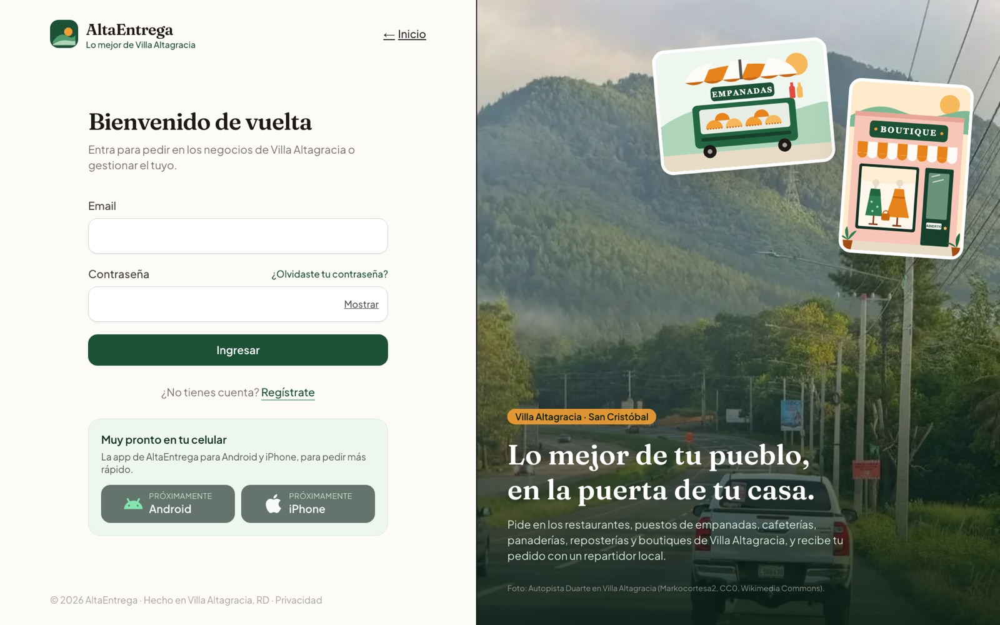

# AltaEntrega

[](https://github.com/pinedavizcainoomaralejandro-create/AltaEntrega/actions/workflows/ci.yml)


**Pedidos y delivery para los negocios de Villa Altagracia, República Dominicana.** Restaurantes, puestos de empanadas, cafeterías, panaderías, reposterías y boutiques publican sus productos; los clientes piden desde el celular y un repartidor local los entrega.

**Demo en producción:** https://altaentrega.netlify.app

| Catálogo | Acceso |
|---|---|
|  |  |

## Qué hace

Una sola plataforma con cuatro roles, cada uno con su propio panel:

- **Cliente:** busca por categoría o producto, arma el carrito, paga y sigue el pedido en vivo.
- **Negocio:** gestiona productos con fotos, recibe pedidos en tiempo real y los confirma y prepara.
- **Repartidor:** ve la bolsa de pedidos listos, acepta uno y lo lleva hasta la entrega.
- **Administrador:** aprueba negocios y repartidores, ve métricas, controla pedidos y configura el cobro.

También se instala como PWA y tiene apps nativas para Android e iOS con Capacitor.

## Aspectos técnicos destacados

- **Seguridad en la base de datos, no solo en el frontend.** Todas las tablas usan Row Level Security de Postgres. Los pedidos solo cambian a través de funciones SQL `SECURITY DEFINER` que validan rol y estado. Nadie puede registrarse como admin ni cambiarse de rol.
- **Concurrencia resuelta en SQL.** El checkout bloquea filas para no vender stock que no existe. Si dos repartidores aceptan el mismo pedido a la vez, `claim_order` solo se lo da a uno.
- **Tiempo real.** Cliente, negocio y repartidor ven cada cambio de estado al instante con Supabase Realtime.
- **Pagos y contabilidad.** Integración con la pasarela AZUL, comisión de la plataforma calculada en la base y libro contable (`ledger_entries`) con el reparto a cada negocio. Hoy funciona con transferencias y suscripciones; el cobro con tarjeta queda listo para una fase posterior.
- **Pruebas y CI.** Pruebas unitarias con Vitest y pruebas de reglas de negocio y seguridad contra un Postgres real. GitHub Actions corre lint, typecheck, pruebas, build y pruebas de base de datos en cada push.
- **Producción.** Desplegado en Netlify, con cabeceras de seguridad (CSP), límite de peticiones por IP y 24 migraciones SQL versionadas.

## Stack

| Capa | Tecnología |
|---|---|
| Frontend | Next.js 16 (App Router, Server Actions), React 19, TypeScript, Tailwind CSS |
| Backend | Supabase: Auth, Postgres con RLS, funciones SQL, Storage y Realtime |
| Móvil | PWA y Capacitor 8 (Android e iOS) |
| Calidad | Vitest, pruebas SQL, ESLint, GitHub Actions |
| Infraestructura | Netlify |

## Autor

**Omar Alejandro Pineda Vizcaíno**. Diseño, desarrollo y despliegue del proyecto completo.

---

Lo que sigue es la documentación técnica para correr el proyecto.

## Setup

Requiere Node.js 20.9 o superior.

1. Instala dependencias:
   ```bash
   npm install
   ```
2. Crea un proyecto en [supabase.com](https://supabase.com) y copia `.env.local.example` a `.env.local` con tus credenciales (Project Settings → API):
   ```bash
   cp .env.local.example .env.local
   ```
   Variables: `NEXT_PUBLIC_SUPABASE_URL`, `NEXT_PUBLIC_SUPABASE_ANON_KEY`, `NEXT_PUBLIC_SITE_URL` (la URL pública de la app, para enlaces de correo y el retorno del pago; en producción pon tu dominio), `SUPABASE_SERVICE_ROLE_KEY` (solo servidor: registra el resultado de los pagos; nunca le pongas el prefijo `NEXT_PUBLIC_`) y las de AZUL (ver *Pagos*). En Supabase, **Authentication → URL Configuration**, deja en *Redirect URLs* solo tu dominio y `http://localhost:3000/**`.
3. Aplica las migraciones de `supabase/migrations/` con la [Supabase CLI](https://supabase.com/docs/guides/local-development/cli/getting-started), desde la carpeta del proyecto:
   ```bash
   supabase login
   supabase link --project-ref <tu-project-ref>
   supabase db push
   ```
   Si prefieres el SQL Editor del dashboard, pega todos los archivos en orden de nombre (el prefijo es la fecha).
4. Levanta el servidor:
   ```bash
   npm run dev
   ```

## Scripts

| Comando | Qué hace |
|---|---|
| `npm run dev` | Servidor de desarrollo en http://localhost:3000 |
| `npm run build` | Build de producción |
| `npm run lint` | ESLint |
| `npm run typecheck` | TypeScript sin emitir archivos |
| `npm test` | Pruebas unitarias (Vitest): validaciones, carrito, mensajes de error |
| `npm run test:db` | Aplica todas las migraciones en un Postgres local temporal y prueba las reglas de negocio y seguridad (`tests/db/checks.sql`). Requiere `psql`/`createdb`. |
| `npm run gen:types` | Genera `src/types/supabase.ts` desde el proyecto enlazado |

El workflow `.github/workflows/ci.yml` corre lint, typecheck, pruebas, build y las pruebas de base de datos en cada push y pull request.

## Fases de cobro

Se cambian en `/admin` → *Configuración de cobro* (`platform_settings.fase`):

- **Fase 1 · Transferencias y suscripciones** (inicio, por defecto): el cliente usa la plataforma gratis. Al pedir ve la cuenta bancaria del negocio, le transfiere los productos y sube el comprobante; el negocio lo confirma en *Pedidos* y el pedido entra. El delivery se paga en efectivo al repartidor. Negocios y repartidores pagan una suscripción mensual (RD$1,000 y RD$500) o anual con 15% de descuento, transfiriendo a la cuenta de ganancias del fundador y subiendo el comprobante, que el admin aprueba. Tienen 30 días de prueba desde su aprobación; al vencer, 5 días de gracia y luego pausa (el negocio no sale en el catálogo y el repartidor no acepta entregas). Todos los valores se ajustan en `/admin`. Los comprobantes van al bucket privado `comprobantes`.
- **Fase 2 · AZUL y comisión** (cuando haya más popularidad): lo que se describe a continuación. Las suscripciones dejan de aplicarse.

## Pagos (AZUL, fase 2)

- El cliente paga con tarjeta en la Página de Pagos de AZUL al terminar el carrito. El pedido se crea `esperando_pago` y reserva el stock; pasa a `pendiente` (y le llega a la tienda) cuando AZUL confirma el pago. Si el pago se rechaza, se cancela o pasan 30 minutos, el pedido se cancela y el stock vuelve.
- **Precios**: `products.precio` es lo que recibe la tienda. El cliente ve ese precio más la comisión de la plataforma (5% por defecto) a través de la vista `catalog_products`; la comisión solo existe en la base (`platform_settings`, solo admin) y el cliente no puede leer el precio base. El delivery (tarifa fija) aparece como línea aparte.
- **Delivery contra entrega**: en línea solo se cobran los productos; el cliente le paga el delivery en efectivo al repartidor, que se lo queda.
- **Reparto al cobrar**: en el instante en que se aprueba el pago, `confirm_payment` acredita a cada negocio su precio publicado y a la plataforma su comisión (`ledger_entries`), y crea dos transferencias (`payouts`): una a la cuenta bancaria del negocio (`store_payout_accounts`, la registra en *Cobros*) y otra a la cuenta de ganancias del fundador (se configura en `/admin`).
- **Conector de transferencias** (`src/lib/payments/payouts.ts`, variable `PAYOUTS_PROVIDER`): en modo `manual` las transferencias quedan en `/admin` con el monto y la cuenta exacta, y el fundador las ejecuta desde su banco y registra la referencia. Cuando AZUL (pagos divididos) o un banco ofrezcan API de transferencias, se agrega ahí el proveedor y se envían solas en el mismo momento del cobro.
- Los pedidos pagados que se cancelan revierten lo acreditado y quedan como *reembolso pendiente* para hacerlo desde el portal de AZUL.
- **Modos** (`AZUL_MODE`): `simulado` (desarrollo, sin cobrar; deshabilitado en producción), `pruebas` (ambiente de pruebas de AZUL) y `produccion`. Para `pruebas`/`produccion` configura `AZUL_MERCHANT_ID`, `AZUL_MERCHANT_NAME`, `AZUL_MERCHANT_TYPE` y `AZUL_AUTH_KEY`, que entrega AZUL al afiliar el comercio.
- **Antes de producción**: `src/lib/payments/azul.ts` marca con `VERIFICAR` los detalles (nombres de campos, orden y codificación del AuthHash, URLs) que hay que confirmar contra la guía vigente de AZUL y probar con un pago real en el ambiente de pruebas.

## Roles y flujo

- **Registro** (`/register`): el usuario elige **Cliente**, **Tienda** o **Delivery**. La base impide registrarse como admin o cambiarse el rol.
- **Tienda / Delivery**: completan su perfil (`/complete-profile/...`) y quedan en `/pending-approval` hasta que un admin los apruebe. Si los rechaza, pueden corregir sus datos y reenviar la solicitud. Un repartidor aprobado ya no puede cambiar su cédula, matrícula ni vehículo.
- **Cliente**: navega el catálogo, arma un carrito de una sola tienda y hace el checkout. El carrito compara precio y stock con la base al abrirlo.
- `src/proxy.ts` (antes `middleware.ts`) protege las rutas por rol y estado de aprobación. Todas las pantallas tienen un enlace **Inicio**.

### Estados de un pedido

| Estado | Quién lo avanza |
|---|---|
| `pendiente` → `confirmado` → `preparando` | La tienda (`store_advance_order`) |
| `preparando` → `en_camino` → `entregado` | El repartidor asignado (`advance_order_status`) |

- Los repartidores ven en la bolsa los pedidos ya **confirmados** sin repartidor y los aceptan con `claim_order` (atómico: si dos aceptan a la vez, solo uno lo obtiene).
- **Cancelación** (`cancel_order`, devuelve el stock): el cliente mientras está `pendiente`; la tienda antes de `en_camino`; el admin mientras no esté `entregado`.
- Cada cambio queda en `order_status_history` y se ve en vivo con Supabase Realtime.
- Los pedidos solo se escriben a través de esas funciones SQL (`SECURITY DEFINER`); no hay inserts ni updates directos desde la API.

## Paneles

- **Tienda** (`/dashboard/tienda`): pedidos en vivo (confirmar, preparar, cancelar, ver productos y contacto del cliente), productos (fotos en Storage; los que ya tienen ventas se ocultan en vez de borrarse) y perfil de la tienda.
- **Delivery** (`/dashboard/delivery`): disponibilidad, bolsa de pedidos con dirección de recogida y de entrega, y mis entregas con productos y contactos.
- **Admin** (`/admin`): métricas (en hora de República Dominicana), aprobación de tiendas y repartidores, y tabla paginada de pedidos con cancelación.

## Estructura

```
src/
  proxy.ts              protección de rutas por rol/estado
  lib/supabase/         clientes de Supabase (browser, server, proxy), storage, perfil
  lib/validation.ts     validaciones compartidas (teléfono, contraseña, cédula, búsqueda...)
  lib/errors.ts         mensajes de error en español para el usuario
  lib/cart/             carrito (contexto + reconciliación con la base)
  app/(auth)/           login, registro, recuperar contraseña
  app/(catalog)/        catálogo, tienda, carrito, mis pedidos
  app/complete-profile/ solicitudes de tienda y repartidor
  app/dashboard/        paneles de tienda y delivery
  app/admin/            panel de administrador
  types/database.ts     tipos de la base de datos
supabase/migrations/    SQL versionado (esquema, RLS, funciones)
tests/                  pruebas unitarias y de base de datos
```
